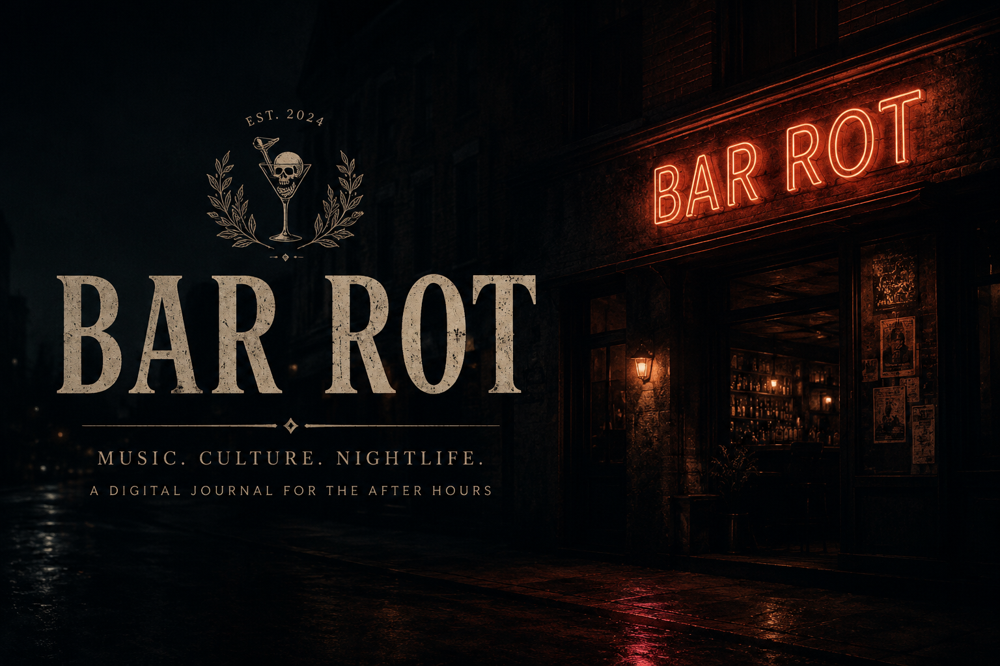
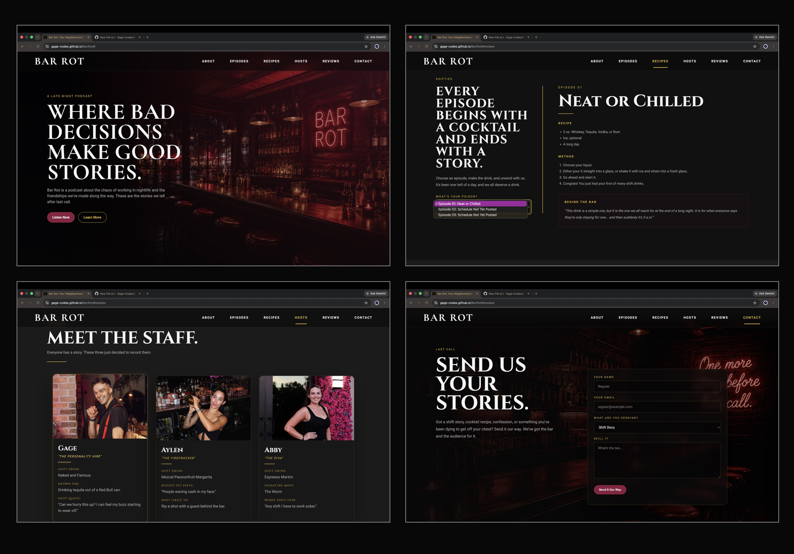

# BAR ROT

### *Where cocktails, conversation, and culture collide.*

[ Live Website](#)

[ Podcast](#)

[ Recipes](#)

Bar Rot began as an exploration of storytelling through web design.
I wanted to create more than a website, I wanted to build a believable brand. Every page, animation, photograph, and interaction was designed to capture the atmosphere of late-night conversations, vinyl records spinning in dimly lit bars, and the culture that grows around a great cocktail.
Although fictional, Bar Rot was designed as if it were preparing for a real-world launch, complete with branding, social media presence, podcast episodes, recipes, and marketing assets.
Every project in my portfolio explores a different industry through a distinct visual identity.
Bar Rot focuses on entertainment branding using typography, photography, animation, and layout to create an immersive experience rather than simply presenting information.
The objective wasn't to recreate an existing website.
It was to build a brand that feels authentic.

  

Features: 
- Responsive layout across desktop, tablet, and mobile
- Animated navigation menu
- Custom branding and identity
- Podcast episode showcase
- Cocktail recipe section
- Mobile-first improvements
- Open Graph integration
- Optimized project structure
- Git version control
- This project evolved through dozens of iterations.

Some of the challenges included:
- Mobile navigation redesign
- Responsive image layouts
- CSS restructuring
- Git and GitHub workflow
- Performance optimization
- Social media previews
- Cross-device testing

Rather than treating these as obstacles, each became an opportunity to improve the overall user experience.
Bar Rot taught me that successful front-end development is about far more than writing code.
It requires balancing usability, branding, accessibility, performance, and storytelling into one cohesive experience.

I'm Gage, a front-end developer passionate about creating immersive digital experiences through thoughtful design and clean code.
Bar Rot is the first project in a larger portfolio where every project explores a different industry through its own visual language and user experience.

Designed & Developed by Gage
"Good design tells a story before a single word is read."

